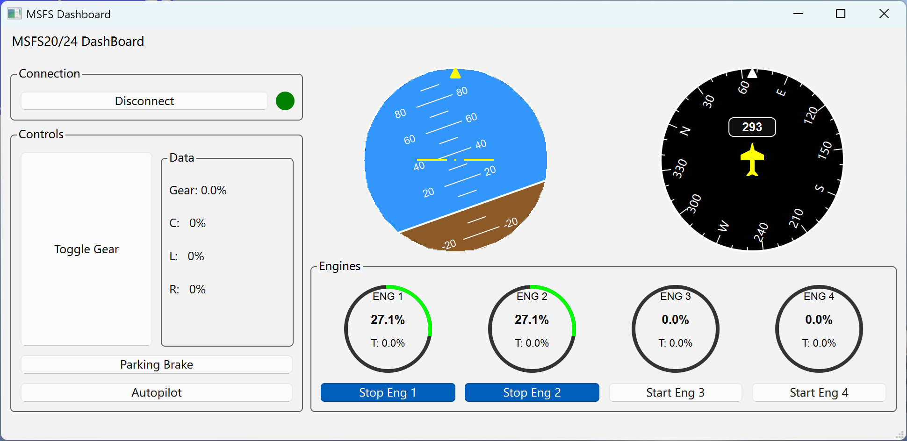

# MSFS Dashboard

这是一个微软模拟飞行2020/2024的仪表盘程序。  
我儿子特别喜欢模拟飞行，但很多操作靠手柄不是那么直接和方便，所以做了几个他常用的控制按钮，并根据他的要求设定了一些习惯。

## 截图

### 仪表盘

### 游戏内截图

## 构建

[构建说明]

## 使用
Qt6.9，当然你可以自行更换版本，并修改cmakelists.txt即可
[使用说明]
编译后，在build文件夹中双击MSFSDashboard.exe即可（对了，你必须先启动MSFS2020或者2024）

## 许可证

[许可证] 